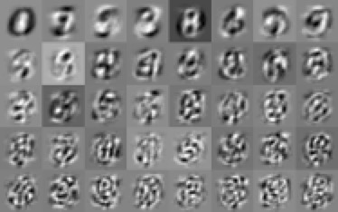

# ITE4052: Computer Vision
Fall 2020, Hanyang University.  
  

### [HW1:](hw1) Image Convolution with Gaussian Filter.

[[specification]](hw1/doc/spec.pdf) [[report]](hw1/doc/report.pdf)  
Got score of 100/100.

### [HW2:](hw2) Feature Detection with Harris Corner Detection.  
[[specification]](hw2/doc/spec.pdf) [[report]](hw2/doc/report.pdf)  
Got score of 100/100.

### [Final:](final) Finding eigenfaces on MNIST.  
[[specification]](final/doc/spec.pdf) [[report]](final/doc/report.pdf)  
Got score of 100/100.

